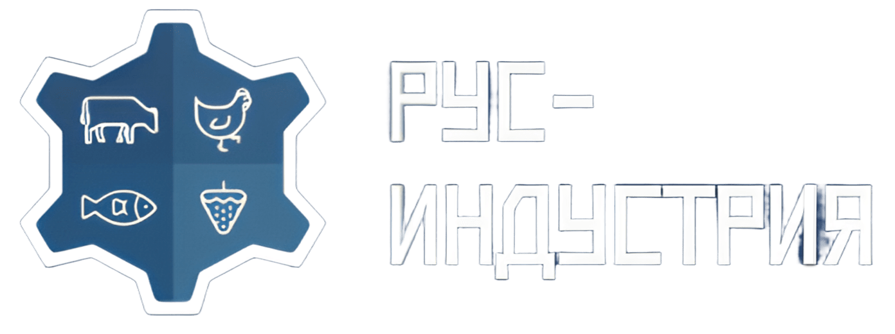

<p align="center">
  
</p>

<h1 align="center">РУС-Индустрия</h1>
<p align="center">
  <strong>Оборудование и отечественное ПО для цифровых пищевых производств</strong>
</p>

<p align="center">
  <a href="#-о-проекте">О проекте</a> •
  <a href="#-возможности">Возможности</a> •
  <a href="#-технологии">Технологии</a> •
  <a href="#-запуск">Запуск</a> •
  <a href="#-структура">Структура</a>
</p>

<p align="center">
  
  
  
  
  
</p>

---

## О проекте

Корпоративный сайт **АО «РУС-Индустрия»**: каталог оборудования, программных продуктов MES/WMS и информационные разделы для пищевой промышленности.

- Весовое и маркировочное оборудование, интеграция с «Честный знак»
- Отечественное ПО: MES FOODTECH, WMS FOODTECH, СУПРИМ BACK, Сервер производителя
- Многоязычность (RU / EN), адаптивная вёрстка, AI-чат для подбора решений

---

## Возможности

| Раздел | Описание |
|--------|----------|
| **Главная** | Hero, каталог ПО, целевая аудитория, преимущества, схема работы, форма обратной связи |
| **Оборудование** | Весовые линии, маркировочные станции, MES/WMS, линии упаковки — с детальными характеристиками |
| **Честный знак** | Спецстраница по внедрению маркировки |
| **Политики** | Конфиденциальность, персональные данные, cookies |
| **Чат-виджет** | Режимы: инженер / техподдержка / консультант; умные вопросы, сбор ТЗ, отправка лида |

---

## Технологии

**Ядро:** React 18, TypeScript, Vite 5, React Router 6  

**UI:** Tailwind CSS, shadcn/ui (Radix UI), Lucide Icons  

**Данные и формы:** TanStack Query, React Hook Form, Zod  

**Локализация:** i18next, react-i18next  

**Тесты:** Vitest, Testing Library, Playwright (E2E)  

**Качество:** ESLint, Prettier  

---

## Запуск

**Требования:** Node.js ≥ 20

```bash
# Установка зависимостей
npm install

# Режим разработки (http://localhost:8080)
npm run dev

# Production-сборка
npm run build

# Просмотр сборки
npm run preview
```

### Основные команды

| Команда | Описание |
|---------|----------|
| `npm run dev` | Запуск dev-сервера |
| `npm run build` | Сборка для production |
| `npm run preview` | Локальный просмотр сборки |
| `npm run lint` | Проверка ESLint |
| `npm run format` | Форматирование Prettier |
| `npm run test:unit` | Юнит-тесты (Vitest) |
| `npm run test:e2e` | E2E-тесты (Playwright) |

---

## Структура проекта

```
src/
├── components/       # UI и секции (Header, Hero, EquipmentCatalog, ChatWidget…)
│   ├── layout/       # PageLayout
│   └── ui/           # shadcn/ui примитивы
├── config/           # Роуты, навигация, конфиг чата
├── data/             # Статика: каталог оборудования, описание ПО
├── hooks/            # useChat, useToast, useMobile
├── i18n/             # Локали (ru, en)
├── lib/              # Утилиты, логика чата (offline, techSpec)
├── pages/            # Страницы роутинга
├── types/            # Типы (chat, equipment, softwareProduct)
├── App.tsx
└── main.tsx
```

---

## Лицензия

© АО «РУС-Индустрия». Все права защищены.
